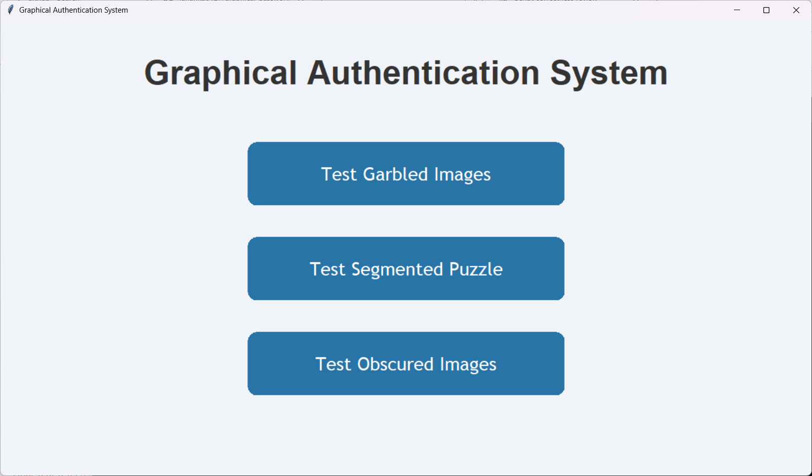
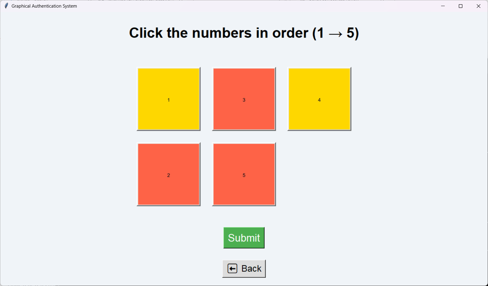
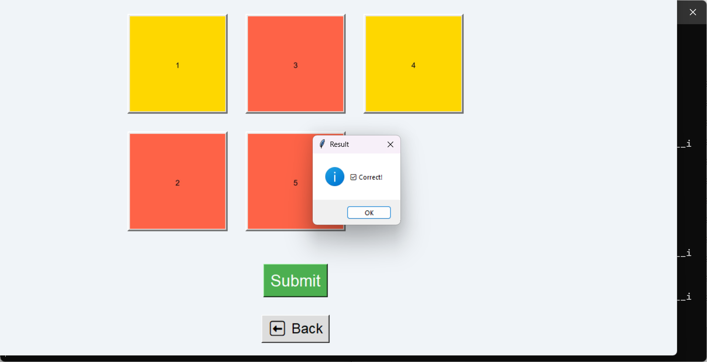
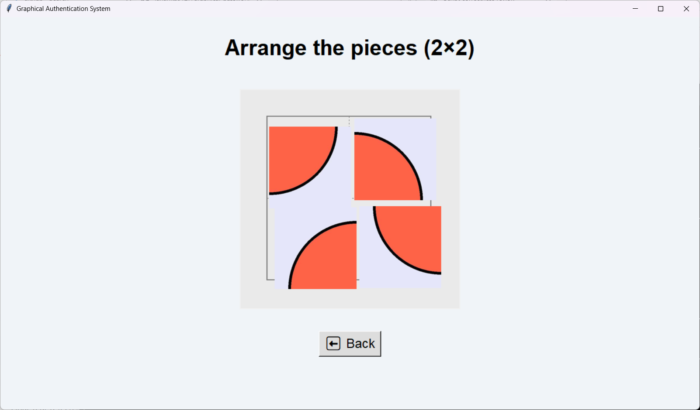
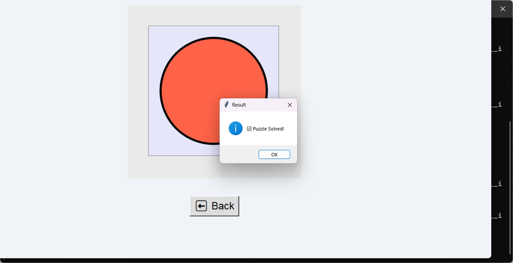
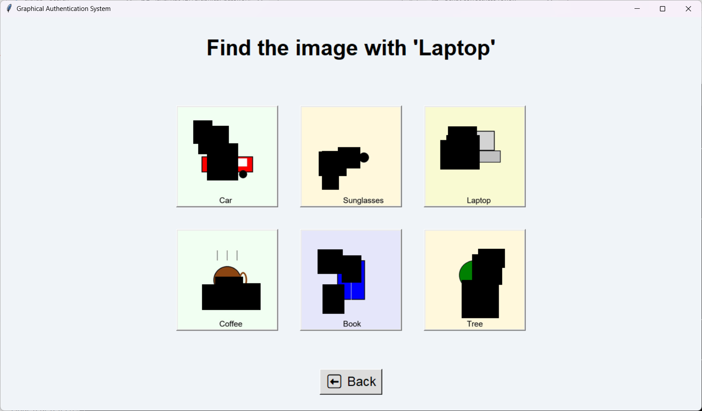
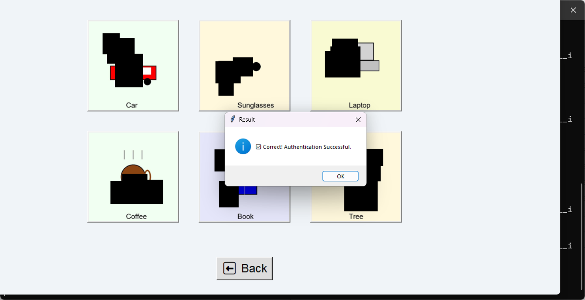

# 🔐 Graphical Password Authentication System

A simple and secure **Graphical Password Authentication System** using Python and Tkinter.  
Users select a sequence of images instead of typing traditional passwords for authentication.

> 👩‍💻 Developed by **Laharika Reddy**  
> 🎓 B.Tech CSE (AI & ML)  
> 📅 August 2025  
> 📂 Repository: [Graphical Password Authentication](https://github.com/laharika0127/graphical-password-authentication)

---

## 📌 Features

- 🖼️ Graphical password-based login system  
- 👤 User registration using image sequences  
- 💾 Data storage using SQLite  
- 🔐 Pattern validation for authentication  
- 🧪 Simple GUI with Python’s Tkinter

---

## 🛠️ Technologies Used

- Python  
- Tkinter  
- SQLite  
- Pillow (PIL)

---

## 🚀 How to Run

1. **Clone the repository**
```bash
git clone https://github.com/laharika0127/graphical-password-authentication.git
cd graphical-password-authentication
```

2. **Install required libraries**
```bash
pip install pillow
```

3. **Run the application**
```bash
python main.py
```

---

## 🧾 Requirements

- Python 3.7+  
- Pillow

Install with:
```bash
pip install pillow
```

---

## 📸 Screenshots

### 🏠 Main Menu  


### 🔢 Number Order Puzzle  
  


### 🧩 Segmented Puzzle  
  


### 🔲 Obscured Image Authentication  
  


---

## 📄 License

This project is open-source and licensed under the [MIT License](LICENSE).

---

## 🙋‍♀️ Author

**Laharika Reddy**  
Final Year B.Tech Student – CSE (AI & ML)  
GitHub: [@laharika0127](https://github.com/laharika0127)
